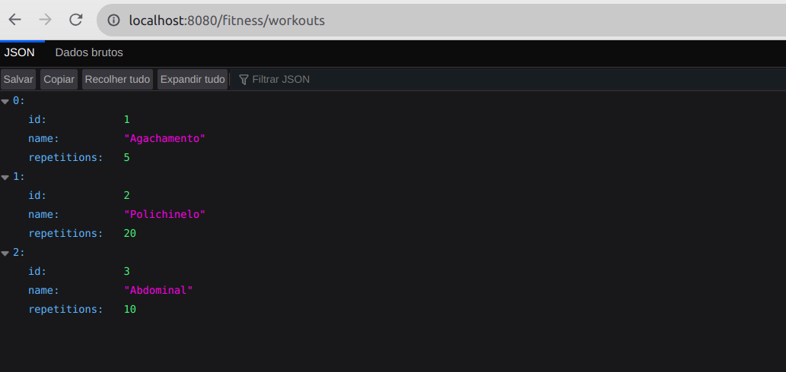

# 💪🏋️ Fitness API
Neste projeto foi desenvolvido uma API REST em Java utilizando o Spring e aplicando os conceitos como camada de serviço e de controle, DTOs, record e as anotações para mapeamento de rotas.

## ⚙️ Instalação das dependências
Para instalar as dependências do projeto, execute o comando `mvn install`. Isso fará o download das dependências configuradas no `pom.xml`, além de baixar as dependências indiretas.

## :white_check_mark: Funcionalidades Implementadas
### (1) Implementação dos DTOs `WorkoutDto` e `WorkoutCreationDto`

### (2) Implementação da classe `FitnessService` como camada de serviço

### (3) Implementação da classe `FitnessController` como camada de controle REST

### (4) Rota GET /fitness

### (5) Rota GET /fitness/workouts/{id}

### (6) Rota POST /fitness/workouts

### (7) Rota GET /fitness/workouts
 
## 💻 Visualize este projeto:

## 🧹 Linter (Checkstyle)
O Checkstyle é usado para fazer a análise estática do código. Este projeto já vem com as dependências relacionadas ao linter configuradas no arquivo `pom.xml`. Caso deseje rodar o Checkstyle manualmente, basta executar o comando `mvn checkstyle:check`.

## :information_source: Considerações finais
Este projeto é apenas para fins educacionais. Qualquer dúvida ou sugestão, sinta-se à vontade para entrar em contato.
